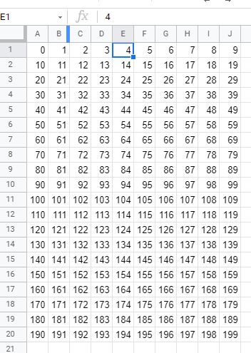
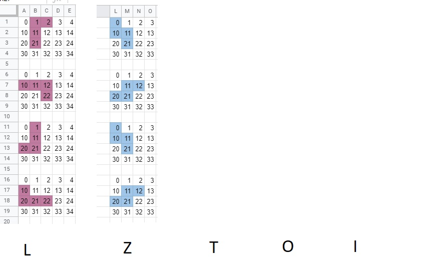

# Tetris

I built this by following [Ania Kubów's tutorial](https://www.youtube.com/watch?v=w1JJfK09ujQ), thank you Ania for sharing your passion for code with the world.

Her orginal code is here https://github.com/kubowania/Tetris-Basic, its encouraged not to copy but rather build and follow the tutorial.

## The grid

Simple google sheets method to visualize the grid. Its 10 by 200 squares and zero based.

## Tetrominoes

- [View my Google sheets doc here](https://docs.google.com/spreadsheets/d/1AUCZV330Kh-ACKLboJx5S2HNRUaSG_O0gPRsVTWLxHM/edit?usp=sharing)

These are the shapes that fall down and build up the lines, they can be rotated. The way I made sense of this in my head (based on the below) they rotated counter clockwise on B11 below.

