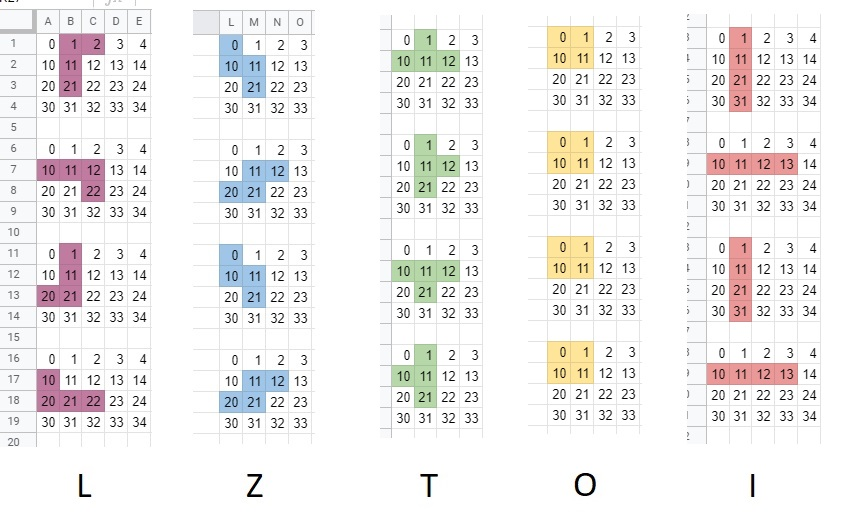

# Tetris

I built this by following [Ania Kubów's tutorial](https://www.youtube.com/watch?v=w1JJfK09ujQ), thank you Ania for sharing your passion for code with the world.

## The grid

Simple google sheets method to visualize the grid. Its 10 by 200 squares.

## Tetrominoes

These are the shapes that fall down and build up the lines, they can be rotated.

